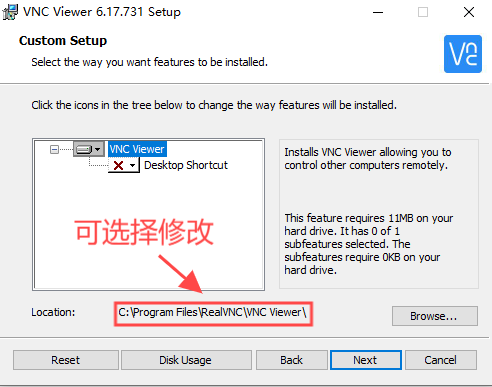

# 1. 注意事项（道听途说）  
1. 提交的作业只需要提交视频，不需要提交代码。  
2. 可以从动作组里选一些动作代替`wave`。  
3. 提交的视频需以学号-姓名-作业名称（颜色识别、踢球等）命名。
4. 连接机器人时请保证自己的电脑连接了实验室的wifi，(ry408?rs408)
5. 作业1必须拍到自己的电脑屏幕，展示识别效果。
6. 作业4说的标签指的是面向大屏幕左边第二排的前边的桌上的二维码，一共三张，依次代表0、1、2。  
7. 作业3的线一共两条，都是黑色胶布粘出来的，一条在前边地上，一条在最前边的桌子上。  
8. 作业2踢球如果发现机器人停止不动，但是不踢，画面里也没有小球了，可以手动把小球举起来，放到画面中大概中间的位置，触发笨蛋机器人的踢球动作，然后在麻溜的把球放在地上，让机器人踢，后期再剪辑掉即可。  
9. 作业3巡线如果发现自己的代码找的不准，可以使用桌面上的LAB_Tool检查一下黑色的参数，调一调直到画面中只有黑色线为白色，而其他背景的为黑色，记录下参数更新到LAB_config里,应该也是在Tonypi目录下。  
10. 作业1物品轮廓找的不准同理第七点。

   
# 2. 环境准备  
`已经弄好的可以直接忽略。`  
### （1）VNC  

[点击下载安装包](VNC-Viewer-6.17.731-Windows.exe)  
  
下载完成后单击安装，过程中唯一要注意的事情如下，其他的可以直接next、ok。  
  
  

安装完成后，在你安装的目录下找到：
    
  
  
单击打开后进入到如下界面，说明成功。

  
  
### （2）Xftp  
  
[点击链接，去到教程](https://blog.csdn.net/m0_52985087/article/details/135645374)

# 3. 操作步骤  

### （1）连接机器人  

#### VNC的连接步骤如下图所示：  

  

连接完成后会进入到如下界面：  

  
  
#### xftp的连接步骤如下图所示：  

  

连接成功后会进入到如下界面：  

  
  
### （2）运行代码，完成作业  

1. 回到xftp,界面中如果你想本地打开某个文件，只需要对着文件右键，然后点击打开即可。

  
  
2. 准备好代码之后，回到VNC，如下图所示：

  

3. 点击后的界面如下图：

  

